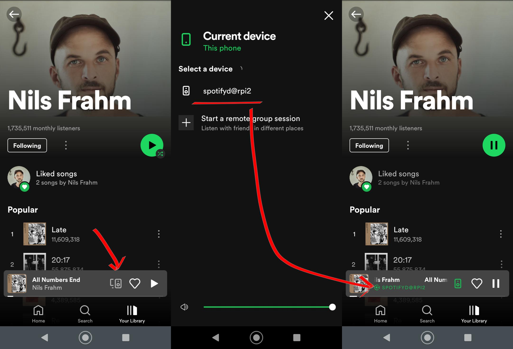
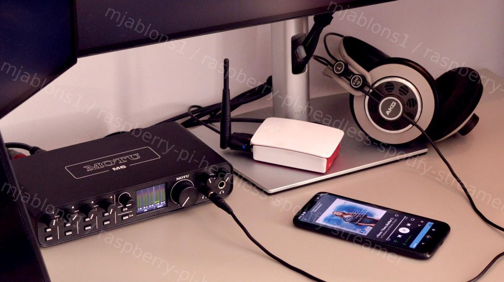

# raspberry-pi-headless-spotify-streamer
## A simple, reliable, headless spotify streamer setup using Raspberry Pi.


If you want to easily control your spotify streaming from any spotify client session, playback high quality and, once configured, forget all about your RPI streamer, this is for you.

Its

* Easy to set up and easy to run.
* Robust against rpi restarts.
* RPI does not need to "know" your spotify credentials.

	<details>
	<summary>Click to learn more</summary>
    * The streaming device does not have to authenticate itself into the streaming service, only your mobile phone app does the way you normally use it. This greatly simplifies the setup or improves the security in case you'd otherwise come up with the bad idea to put your credentials in plain into some config file... (dont!)
	</details>

## Prerequisites

* Spotify account and Spotify app installed on any computer or mobile device 
	* this will be now used just as authentication, music browsing and remote control session, the bare-bones straeming will be offloaded to RPI
* Rpi (I used Rpi 2B equipped with a USB WIFI adapter and with Debian 11, bullseye image)
* USB class-compliant audio interface (I used MOTU M6)

The key software component will be an application called [spotifyd](https://github.com/Spotifyd/spotifyd). What's most interesting for us is that spotifyd supports Spotify Connect which is a feature that makes your rpi show up as a viable playback device in your offical spotify application. You can find all instructions how to get it working here [Spotifyd Wiki](https://spotifyd.github.io/spotifyd/installation/Raspberry-Pi.html?search=ystesystem). 

Thanks, bye!

-----------------

<details>
<summary>...well yes of course, there is a catch.</summary>

If you are any demanding you will notice immediately that the audio quality with the defaults is much worse than streaming directly from your laptop over USB into your audio interface. 

To make full use of your audio interface while streaming off Rpi a few details need polishing. This article is mainly to help you know what need to be changed and where to get good audio quality while running within the computation limits of even an old RPI like the B2.
 </details>
 
 -----------------

## The setup (starting from the beginig)

We will first define a service in Debian to make it simple for spotifyd to be launched each time the system boots, without the need of any intervention from the user. We set off by creating a service dfinition file (you need to copy a file template from below so its best to start from desktop first):

```console
startx
mkdir -p ~/.config/systemd/user/
nano ~/.config/systemd/user/spotifyd.service
```

copy and save below content to the service file:

```console
-----spotifyd.service------------------------------
```

```console
[Unit]
Description=A spotify playing daemon
Documentation=https://github.com/Spotifyd/spotifyd
Wants=sound.target
After=sound.target
Wants=network-online.target
After=network-online.target

[Service]
ExecStart=/usr/bin/spotifyd --no-daemon
Restart=always
RestartSec=12

[Install]
WantedBy=default.target
```

```console
----------------------------------------------------
```

-----------------

<details>
<summary>Click to learn more.</summary>
This file tells Linux what application to start (ExecStart) - we'll put spotifyd binary on that path in just a moment. And what other services should be readily running after reboot to allow spotifyd to operate (sound service and internet connection). In case of a crash we want the service to restart automatically. Default.target refers to the user account that the system boots into by default.
</details>

-----------------

Now its time to pull spotifyd application. There are a few builds for Debian readily available, in case of my Rpi2 B the URL is a match for the ARMv7 architecture. In case you use older or newer RPI still you may have to look around to match the [correct build](https://github.com/Spotifyd/spotifyd/releases).

```console
wget -O spotifyd-linux.tar.gz https://github.com/Spotifyd/spotifyd/releases/download/v0.3.4/spotifyd-linux-armhf-default.tar.gz
sudo tar xf spotifyd-linux.tar.gz -C /usr/bin
```
<details>
<summary>Click to learn more.</summary>
Last line untars the spotify file to /usr/bin which is exactly the way we have specified it in the service file.
And that's it for the basic functionality. All we need to do left is restart the systemd manager, start the spotifyd service and enable the service to be allowed to start automatically on reboot.
</details>

```console
systemctl --user daemon-reload
systemctl --user start spotifyd.service
systemctl --user enable spotifyd.service
```

At this point already the streaming functionality should be there. **For as long as your RPI and your mobile phone are in the same wifi network** your mobile app session should now see your rpi as a playback device.



----------------

<details>
<summary>Dont click this if you're happy with the result</summary>

While it worked for me like this i heard:
* generally poor audio quality,
* very frequent clicks from buffer underrun when CPU got busy,
* noticed needless streaming to all 4 output channels of my interface.

</details>

-----------------


## Optimization

Since this is old RPI and we are in a desktop env it should be expected to sweat and perhaps not all hope is lost, if we can boot to cmd line instead the CPU loads should be much lower. We can also tweak some defaults for sound quality that may be low. Therefore now come the optimization part!

### Set the maximum streaming bitrate in spotifyd

...by creating ~/.config/spotifyd/spotifyd.conf. You can also change the device name while you're at it. This is not only for fun but also useful to be sure your new configuration actually took effect (that's how it will be visible in your mobile spotify app).

```console
mkdir ~/.config/spotifyd
vim ~/.config/spotifyd/spotifyd.conf
```
Copy below content to the file and save it

```console
-----spotifyd.conf------------
```

```console
[global]
device_name = "spotifyd@rpi2"
bitrate = 320
```

```console
-------------------------------
```

### Ensure your Rpi does not go to desktop on boot. 

```console
sudo raspi-config
```
Set boot to command line. Also, ensure the option to get automatically logged in is kept.

----

<details>
<summary>Click to learn more</summary>

You can prevent spotifyd service from stopping in case you'd log out (in case you plan to do something else on your RPI while streaming)

```console
sudo loginctl enable-linger username
```

</details>

----

Kiss your desktop last goodbye and...

```console
sudo reboot now
```

After restarting the spotifyd service should start automatically and make your rpi visible as playback device on your mobile phone really quickly now. You should hear less clicks, hopefully. Quality still more or less terrible. Excited? Lets optimize some more.

### Check hw capability settings to check what sampling rate is actually used

In my case I could find my hw capabilties here: (M6 directory name is specific to my interface):

```console
cat /proc/asound/M6/stream0

MOTU M6 at usb-3f980000.usb-1.3.1, high speed : USB Audio

Playback:
  Status: Running
    Interface = 1
    Altset = 1
    Packet Size = 288
    Momentary freq = 44100 Hz (0xc.0000)
  Interface 1
    Altset 1
    Format: S32_LE
    Channels: 4
    Endpoint: 0x02 (2 OUT) (ASYNC)
    Rates: 44100, 48000, 88200, 96000, 176400, 192000
    ...
```
Already here we see we are Running at 41kHz, so defaulting to the minimum.
    
### Check if your capabilities are actually used:

```console
pacmd list-sinks

2 sink(s) available.
...
  * index: 1
	name: <alsa_output.usb-MOTU_M6_M6AE107530-00.analog-surround-40>
	driver: <module-alsa-card.c>
	...
	current latency: 32.25 ms
	max request: 600 KiB
	max rewind: 600 KiB
	monitor source: 1
	sample spec: s32le 4ch 44100Hz
	channel map: front-left,front-right,rear-left,rear-right
	             Surround 4.0
	used by: 1
	linked by: 1
	fixed latency: 30.00 ms
	card: 1 <alsa_card.usb-MOTU_M6_M6AE107530-00>
	module: 8
	properties:
		alsa.resolution_bits = "32"
        ...
```

Sample rate and buffer size are definitely two points that could use some improvements. 

----------------

<details>
<summary>Click to expand</summary>

I started looking for some alsa config files that would contain these settings but could not find any. It turned out that Debian uses Pulseaudio server between your app and alsa and it happens to control sample rate and buffer sizes, alsa just consumes them:


AS a separate item, we have the performance issue (sill occasional clicks even in cmd line mode) To see what's cooking with the performance

```console
top
```

Both Pulseaudio and Spotifyd consumed 15-25% of the CPU time each.... thats way too much!


</details>

-----------------

### Modify pulseaudio config;

----

<details>
<summary>Click to learn more</summary>

<a href="https://wiki.archlinux.org/title/PulseAudio#Configuration">NOTE FROM DOCUMENTATION:</a> PulseAudio will first look for configuration files in the home directory ~/.config/pulse/, and if they are not found, the system-wide configuration from /etc/pulse/ will be applied. It is strongly suggested not to edit system-wide configuration files, but rather edit user ones. Create the ~/.config/pulse directory, then copy the system configuration files into it and edit according to your need.
</textarea>

</details>

----


```console
cp /etc/pulse/daemon.conf ~/.config/pulse/
vim ~/.config/pulse/daemon.conf
```

This file readily contains a lot of commented defaults. Dont forget to remove the semicolon before each line you wish to modify, here are the ones I modified (I checked quite a few combination but tried to make as few changes as possible in the end since I'm otherwise a great fan of, well, default defaults):

```console
-----daemon.conf-------------------------------
```

```console
...
resample-method = src-sinc-best-quality
; avoid-resampling = false
enable-remixing = no
...
; default-sample-format = s16le
default-sample-rate = 96000
; alternate-sample-rate = 41000
; default-sample-channels = 2
; default-channel-map = front-left,front-right

default-fragments = 2
default-fragment-size-msec = 200
...
```

```console
------------------------------------------------
```

----

<details>
<summary>Click to expand</summary>
The default resampling was actually optimized for computation but since this impacts quality i have eventually pushed it up to sinc resampling. To offset that computation cost (and probably few other) in half I set <a href="https://wiki.archlinux.org/title/PulseAudio#Configuration">enable-remixing = no</a>   - this effectively reduced streaming from 4 channels to 2 channels only. Checking with CPU loads pulseaudio went to about half right a way. The last settings set a huge, 2x200ms buffer to minimize clicks from buffer underrun. (this also puts a large lag between your app controls and the sound output but then think of how expensive RPI4 is and forget all about it)

</textarea>

</details>

----

After making these changes restart the pulseaudio and spotify services and check again the alsa settings to confirm the new settings are in effect, you should see sample rate and buffer size updated now:

```console
systemctl --user restart pulseaudio.service 
systemctl --user restart spotifyd.service
pacmd list-sinks
```

----

This is it. With all these changes I was finally happy with the sound quality (and I'm reall a pain-in-the-ass guy in that respect as you can tell by now). 

<details>

<summary>Click to expand</summary>

I noticed much later that with very very loud music that uses compressors src-sinc-best-qualty actually causes clipping. You can overcome this by pulling spotify app volume down by a nod or two though. You can also try other resampling methods.

In this place some of you may wonder what should upsampling change. It's definitely a good question and I have no clear answer to that, after all when we upsample we begin signal reconstruction starting at the sample data as streaming from the service provider. This said I can hear a clear improvement going from 41kHz to 96kHz. I expect that, for once, some of the materials are in 48kHz format to begin with so we dont squander that down to 41kHz. Moreover, by upsampling we actually increase the bit depth of the data points above 16bit and that may be audible as well. Finally we've reduced the compression by requesting 320kB/s data stream instead of the default 160kB/s - here there i no doubt this is audible and has pretty much the same effect as going from normal to very high sound quality setting in the official spotify app.

</textarea>

</details>

----

## Summary:
I run this setup for several weeks now and havent noticed any problems with it. It's stable whether I choose to keep RPI on all the time or shut it down between sessions. I still get an occasional clip once in a while but then i think of how expensive RPI 4 is and that puts a balm on it. I hope you get to enjoy it as much as I do! 

Let me know your experience in discussion. Cheers! 

## References:

[Spotifyd repository](https://github.com/Spotifyd/spotifyd)

[Spotifyd Wiki](https://spotifyd.github.io/spotifyd/installation/Raspberry-Pi.html?search=ystesystem)

[ArchLinux Wiki PulseAudio Config](https://wiki.archlinux.org/title/PulseAudio#Configuration)

Hugs to my daughter for helping with the drawings!

