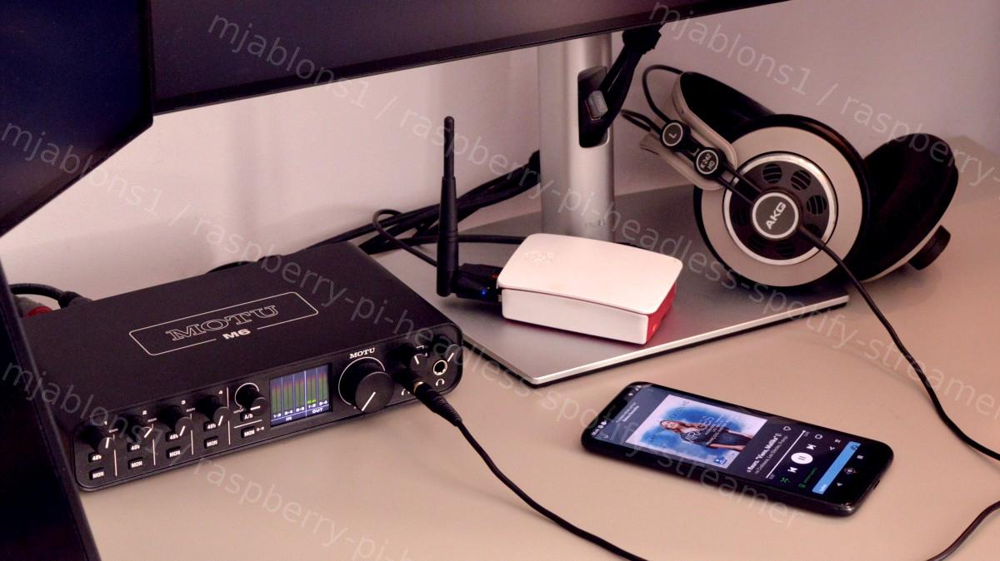

# raspberry-pi-headless-spotify-streamer
## The simplest, reliable Raspberry Pi spotify streamer setup that I know of.

UNDER CONSTRUCTION!



----------------

<details>
<summary>Click to expand</summary>

whatever

</details>

-----------------

If you want to easily control your spotify streaming from any spotify app session, playback high quality and, once configured, forget all about your RPI streamer, just focus on listening, this is for you.

Its

* Easy to set up and easy to run.
* Robust against rpi restarts.
* RPI does not need to know your spotify credentials.
    * <sub>The streaming device does not seem to have to authenticate itself into the streaming service, only your mobile phone app does the way you normally use it. This greatly simplifies the setup or improves the security in case you'd otherwise come up with the bad idea to put your credentials in plain into some config file... (dont!)</sub>

This is done with an application called spotifyd. You can find all instructions here [Spotifyd Wiki](https://spotifyd.github.io/spotifyd/installation/Raspberry-Pi.html?search=ystesystem). 

Thanks, bye!

<details>
<summary>Click to learn more though</summary>
...well yes of course, there is a catch.

If you area any demanding you will notice immediately that the audio quality with the defaults is much worse than streaming directly from your laptop over USB into your audio interface... wait, what? You dont have an audio interface? Go get one and then come back!

 For the rest of you though, to make full use of your audio interface while streaming off Rpi a few details need polishing. This article is mainly to help you know what need to be changed and where to get the most out of your interface capabilities while running within the computation limits of even an old RPI like the B2.
 </details>

## Prerequisites
* Spotify account Spotify app installed on any computer or mobile device 
	* this will be now used just as authentication, music browsing and remote control session, the bare-bones straeming will be offloaded to RPI
* Rpi (I used Rpi 2B equipped with a USB WIFI adapter and with Debian 11, bullseye image)
* USB class-compliant audio interface (I used MOTU M6)

## The setup (starting from the beginig)

We will first define a service in Debian to make it simple for spotifyd to be launched each time the system boots, without the need of any intervention from the user. We set off by creating a service dfinition file:

```console
startx
mkdir -p ~/.config/systemd/user/
nano ~/.config/systemd/user/spotifyd.service
```

```console
---------------------spotifyd.service----------------------------
[Unit]
Description=A spotify playing daemon
Documentation=https://github.com/Spotifyd/spotifyd
Wants=sound.target
After=sound.target
Wants=network-online.target
After=network-online.target

[Service]
ExecStart=/usr/bin/spotifyd --no-daemon
Restart=always
RestartSec=12

[Install]
WantedBy=default.target
----------------------------------------------------------------------------
```
<details>
<summary>Click to learn more though</summary>
This file tells Linux what application to start (ExecStart) - we'll put spotifyd binary in there in just a moment. And what other services should be readily running after reboot to allow spotifyd to operate (sound and internet connection). In case of a crash we want the service to restart automatically. Default.target refers to the user account that the system boots into by default.
</details>

Now its time to pull spotifyd application, there are a few builds for Debian readily available, in case of my Rpi2 B the URL is a match for the ARMv7 architecture. In case you use older or newer RPI still you may have to look around to match the correct build [https://github.com/Spotifyd/spotifyd/releases]

```console
wget -O spotifyd-linux.tar.gz https://github.com/Spotifyd/spotifyd/releases/download/v0.3.4/spotifyd-linux-armhf-default.tar.gz
sudo tar xf spotifyd-linux.tar.gz -C /usr/bin
```
<details>
<summary>Click to learn more though</summary>
Last line untars the spotify file to /usr/bin which is exactly the way we have specified it in the service file.
And that's it for the basic functionality. All we need to do left is restart the systemd manager, start the spotifyd service and enable the service to be allowed to start automatically on reboot.
</details>

```console
systemctl --user daemon-reload
systemctl --user start spotifyd.service
systemctl --user enable spotifyd.service
```

At this point already the streaming functionality should be there. **For as long as your RPI and your mobile phone are in the same wifi network** your mobile app session should now see your rpi as a viable playback device.

### ADD IMAGE HERE ##

While it worked for me like this i heard:
* generally poor audio quality,
* very frequent clicks from buffer underrun when CPU got busy,
* noticed needless streaming to all 4 output channels of my interface.

### MAKE A GRAPHICS OF RPI SWEATING ITSELF

## Optimization

Since this is old RPI and we are in desktop env its to be expected and perhaps not all hope is lost, if we can boot to cmd line instead the CPU loads should be much lower. We can also tweak some defaults for sound quality that may low. Therefore now come the optimization part!

### Set the maximum streaming bitrate in spotifyd config

....by creating a spotifyd file under .config. You can also change the device name (that's how it will be visible in your mobile spotify app) this is not only for fun but also useful to be sure your configuration actually took effect.

```console
mkdir ~/.config/spotifyd
vim ~/.config/spotifyd/spotifyd.conf
```

```console
-----------spotifyd.conf------------
[global]
device_name = "sweating_rpi"
bitrate = 320
------------------------------------
```

### Ensure your Rpi does not go to desktop on boot. 

```console
sudo raspi-config
```
Set boot to command line, and ensure the option to get automatically logged in is kept.

Kiss the desktop last goodbye and...

```console
-sudo reboot now
```

After restarting your spotifyd service should register itself and make your rpi visible as playback device on your mobile phone really quickly now. You should hear less clicks, hopefully. Quality still crap. Excited? Lets optimize some more.

### Check hw capability settings to check what sampling rate is actually used

In my case I could find my hw capabilties here: (M6 directory name is specific to my interface):

```console
cat /proc/asound/M6/stream0

MOTU M6 at usb-3f980000.usb-1.3.1, high speed : USB Audio

Playback:
  Status: Running
    Interface = 1
    Altset = 1
    Packet Size = 288
    Momentary freq = 44100 Hz (0xc.0000)
  Interface 1
    Altset 1
    Format: S32_LE
    Channels: 4
    Endpoint: 0x02 (2 OUT) (ASYNC)
    Rates: 44100, 48000, 88200, 96000, 176400, 192000
    Data packet interval: 125 us
    Bits: 24
    Channel map: FL FR FC LFE
    Sync Endpoint: 0x83 (3 IN)
    Sync EP Interface: 2
    Sync EP Altset: 1
    Implicit Feedback Mode: Yes
    ...
```
Already here we see we are Running at 41kHz, so defaulting to the minimum.
    
### Check if your capabilities are actually used:

```console
pacmd list-sinks

2 sink(s) available.
...
  * index: 1
	name: <alsa_output.usb-MOTU_M6_M6AE107530-00.analog-surround-40>
	driver: <module-alsa-card.c>
	flags: HARDWARE DECIBEL_VOLUME LATENCY 
	state: RUNNING
	suspend cause: (none)
	priority: 9049
	volume: front-left: 65536 / 100% / 0.00 dB,   front-right: 65536 / 100% / 0.00 dB,   rear-left: 65536 / 100% / 0.00 dB,   rear-right: 65536 / 100% / 0.00 dB
	        balance 0.00
	base volume: 65536 / 100% / 0.00 dB
	volume steps: 65537
	muted: no
	current latency: 32.25 ms
	max request: 600 KiB
	max rewind: 600 KiB
	monitor source: 1
	sample spec: s32le 4ch 44100Hz
	channel map: front-left,front-right,rear-left,rear-right
	             Surround 4.0
	used by: 1
	linked by: 1
	fixed latency: 30.00 ms
	card: 1 <alsa_card.usb-MOTU_M6_M6AE107530-00>
	module: 8
	properties:
		alsa.resolution_bits = "32"
		device.api = "alsa"
		device.class = "sound"
		alsa.class = "generic"
		alsa.subclass = "generic-mix"
		alsa.name = "USB Audio"
		alsa.id = "USB Audio"
		alsa.subdevice = "0"
		alsa.subdevice_name = "subdevice #0"
		alsa.device = "0"
		alsa.card = "1"
		alsa.card_name = "M6"
		alsa.long_card_name = "MOTU M6 at usb-3f980000.usb-1.3.1, high speed"
		alsa.driver_name = "snd_usb_audio"
        ...
```

Sample spec and buffer size are definitely two points that could use some improvements.
I started looking for some alsa config files that would contain these settings but could not find any. It turned out that Debian uses Pulseaudio server between your app and alsa and it happens to control sample rate and buffer sizes, alsa just consumes them:

## SHOW A SIMPLE GRAPHICAL REPRESENTATION SPOTIFYD -> PULSEAUDIO -> ALSA -> AUDIO INTERFACE DRIVER

AS a separate item, we have the performance issue (sill occasional clicks even in cmd line mode) To see what's cooking with the performance

```console
top
```

Both Pulseaudio and Spotifyd consumed 15-25% of the CPU time each.... thats way too much!

### Modify pulseaudio config;

PulseAudio will first look for configuration files in the home directory ~/.config/pulse/, and if they are not found, the system-wide configuration from /etc/pulse/ will be applied. It is strongly suggested not to edit system-wide configuration files, but rather edit user ones. Create the ~/.config/pulse directory, then copy the system configuration files into it and edit according to your need.

```console
cp /etc/pulse/daemon.conf ~/.config/pulse/
vim ~/.config/pulse/daemon.conf
```

Remove semicolon before each line you wish to modify, here are the ones I modified ( i did try a lot of combination but tried to make as few changes as possible since I'm otherwise a great fan of, well, default defaults, and so should you) :

```console
--------daemon.conf-------------------------------
...
resample-method = src-sinc-best-quality
; avoid-resampling = false
enable-remixing = no
...
; default-sample-format = s16le
default-sample-rate = 96000
; alternate-sample-rate = 41000
; default-sample-channels = 2
; default-channel-map = front-left,front-right

default-fragments = 2
default-fragment-size-msec = 200
....
--------------------------------------------------
```

The default resampling was actually optimized for computation but since this impacts quality i have eventually pushed it up. What slashes resampling (and probably few other) coputational costs) in half is enable-remixing = no - this effectively reduces streaming from 4 channels to 2 channels only. Checking with top the CPU loads go to about half right a way. The last settings set a huge, 2x200ms buffer. (puts a lag on your controls but I don't care)

After making these changes restart the pulseaudio and spotify services and check again the alsa settings to confirm the new settings are in effect, you should see sample rate and buffer size updated now:

```console
systemctl --user restart pulseaudio.service 
systemctl --user restart spotifyd.service
pacmd list-sinks
```

NOTE: I noticed much later that with very very loud music that uses compressors src-sinc-best-qualty actually causes clipping. You can overcome this by putting spotify app volume down by a nod or two though. You can also try another resampling methods. Its as much as a guess but i think its a bug in this resampling because after such advanced resampling the signal shoulld be normalized, which i don't expect to be done here.

Here some of you may wonder what should upsampling change. After all the source is probably 41kHz, maybe 48kHz at best anyway. While that's true the stream is also 16bit in depth. By upsampling we actually increase the bit depth of the digital data and start making some use of the relatively advanced DA converter in our interface and that is seriously audible.

## add a graph showing upsampling principle and how bit depth improoves

References:

[Spotifyd repository](https://github.com/Spotifyd/spotifyd)

[Spotifyd Wiki](https://spotifyd.github.io/spotifyd/installation/Raspberry-Pi.html?search=ystesystem)

[ArchLinux Wiki PulseAudio Config](https://wiki.archlinux.org/title/PulseAudio#Configuration)

EXTRAS:
Prevent spotifyd service from stopping in case you'd log out (in case you plan to do something else on your RPI while streaming)
sudo loginctl enable-linger username